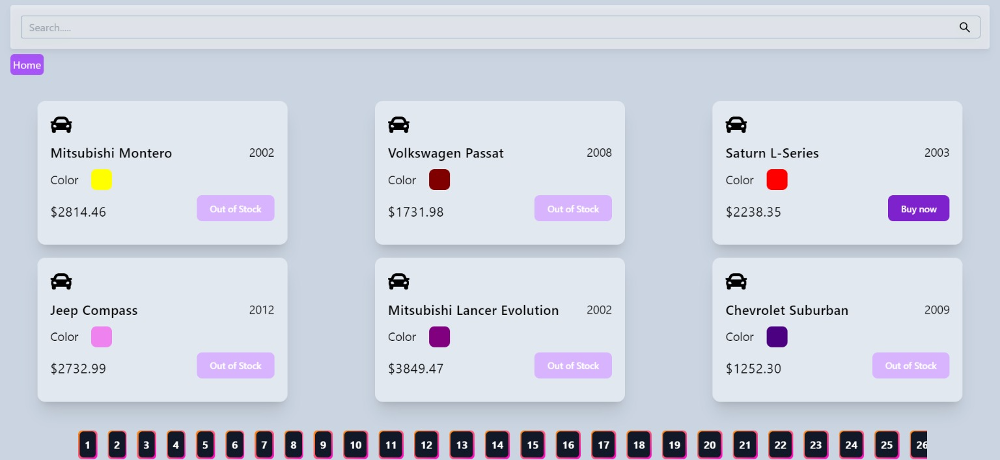

# Car Selling App with Search and Pagination

Selling App built with Vite, React, and other awesome technologies! This application allows users to browse a collection of cars, search for specific cars, and navigate through the results with pagination. The app fetches data from [myfakeapi.com](https://myfakeapi.com/api/cars) using Axios for seamless data integration.



## Features

- **Search Functionality:** Easily find cars by typing keywords in the search bar.
- **Pagination:** Navigate through multiple pages of car listings with the React Router DOM.
- **Interactive UI:** Enjoy a smooth and responsive user interface designed for seamless browsing.
- **Loading Feedback:** Visual feedback with React Spinners while data is being loaded.
- **Toasts:** Instant notifications for user actions using React Hot Toast.
- **Icons:** Utilizes React Icons for a delightful visual experience.

## Prerequisites

Before you begin, ensure you have met the following requirements:

- Node.js installed
- npm or yarn installed
- Basic understanding of React and Vite

## Getting Started

Follow these steps to set up and run the project locally:

1. **Clone the repository:**

   ```sh
   git clone https://github.com/KamalJoshi-web/car-selling-app.git
   ```

2. **Navigate to the project directory:**

   ```sh
   cd car-selling-app
   ```

3. **Install dependencies:**

   If you're using npm:

   ```sh
   npm install
   ```

   If you're using yarn:

   ```sh
   yarn install
   ```

4. **Start the development server:**

   If you're using npm:

   ```sh
   npm run dev
   ```

   If you're using yarn:

   ```sh
   yarn dev
   ```

5. **Open your browser and visit [http://localhost:3000](http://localhost:3000) to view the app.**

## Dependencies

This project relies on the following dependencies:

- [Axios](https://axios-http.com/): For making API requests to [myfakeapi.com](https://myfakeapi.com/api/cars).
- [React Router DOM](https://reactrouter.com/): For handling pagination and routing in the app.
- [React Icons](https://react-icons.github.io/react-icons/): Provides a set of high-quality icons for the UI.
- [React Hot Toast](https://react-hot-toast.com/): For displaying toast notifications.
- [React Spinners](https://www.davidhu.io/react-spinners/): A collection of loading spinner components for React.

## Contributing

Contributions are welcome! Feel free to open an issue or submit a pull request for any improvements or features you would like to add to the project.

Happy coding! 🚗💨
